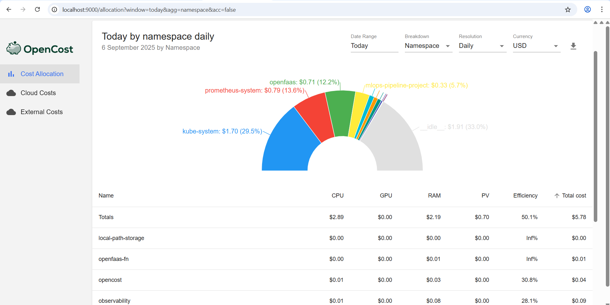

# FinOps in Kubernetes with OpenCost

Kubernetes makes it easy to scale workloads, but it also makes costs… slippery. Pods scale up, nodes scale down (hopefully), and suddenly you get a cloud bill that looks like an unsolved puzzle.

That’s where **FinOps** (Financial Operations) comes in — a practice of bringing financial accountability to cloud spend. And for Kubernetes clusters, **OpenCost** is one of the best open-source tools to track and optimize your workloads’ cost.

In this workshop, we’ll set up OpenCost in a Kubernetes cluster, collect cost metrics, and build a Grafana dashboard to visualize them. By the end, you’ll have a working FinOps setup for your K8s workloads.


---

## FinOps in Kubernetes – Why it Matters

FinOps is not just about saving money — it’s about creating **financial visibility, accountability, and optimization** across engineering, operations, and finance.

In Kubernetes, costs are tricky because:

* Resources are **shared across namespaces, teams, and services**.
* Autoscaling makes spend **dynamic and unpredictable**.
* Cloud bills don’t map neatly to **Kubernetes objects (pods, nodes, namespaces)**.

FinOps helps bridge that gap by answering questions like:

* How much does each **team/namespace** cost per month?
* Which workloads are **over-provisioned**?
* What is the cost impact of **autoscaling**?
* Can we **charge back** costs to product teams?

Enter **OpenCost**: the open-source project that measures Kubernetes costs in real-time.

---

## Prerequisites

Before diving in, make sure you have:

* A running Kubernetes cluster (on-prem or cloud, minikube works too).
* `kubectl` installed and configured.
* `helm` (Helm 3).
* Prometheus + Grafana installed in your cluster. (If not, you can install using the **Prometheus & Grafana Helm charts**.)

## Installing OpenCost on Kubernetes

```bash
kubectl create namespace opencost

helm install opencost --repo https://opencost.github.io/opencost-helm-chart opencost \
  --namespace opencost
```

This deploys OpenCost as a service inside the cluster.

## Verifying OpenCost Installation

Check if pods are running:

```bash
kubectl get pods -n opencost
```

You should see something like:

```
opencost-xxxxxxx   1/1   Running   0   2m
```

## Exploring the OpenCost UI

OpenCost exposes a **built-in UI** for visualizing cost allocations in real-time.

### Port-forward the OpenCost UI

Run:

```bash
kubectl port-forward -n opencost svc/opencost 9000:9090
```

Now open your browser:

[http://localhost:9000](http://localhost:9000)

You should see the **OpenCost dashboard**.



---

## Integrating OpenCost with Prometheus

OpenCost exposes cost metrics in **Prometheus format** at:

```
http://<opencost-service>:9003/metrics
```

Add a **scrape config** so Prometheus pulls OpenCost metrics.

Edit your Prometheus config (`prometheus.yaml` or Helm values):

```yaml
scrape_configs:
  - job_name: 'opencost'
    honor_labels: true
    static_configs:
      - targets: ['opencost.opencost:9003']
```

Apply the updated config and restart Prometheus.

Now you can query OpenCost metrics in Prometheus UI.

## Adding Custom Pricing in OpenCost

By default, OpenCost uses **public cloud list prices** (AWS, GCP, Azure) to estimate costs. But in real-world FinOps, you often want to use:

* **Discounted rates** (Reserved Instances, Savings Plans, enterprise agreements)
* **On-prem pricing** (your internal cost per vCPU, GB RAM, GB storage)
* **Spot instance prices**
* **Blended costs across regions**

OpenCost lets you override default prices with a **custom pricing configuration file**.

### Create a custom pricing config

Create a file named `custom-pricing.json`:

```json
{
  "description": "Custom pricing for on-prem Kubernetes cluster",
  "CPU": "0.02", 
  "RAM": "0.005", 
  "GPU": "0.95", 
  "storage": "0.0002",
  "zoneNetworkEgress": "0.01",
  "internetNetworkEgress": "0.12"
}
```

Here’s what the fields mean:

* **CPU** → price per vCPU per hour (e.g., $0.02/hr)
* **RAM** → price per GB RAM per hour
* **GPU** → price per GPU per hour
* **storage** → price per GB storage per hour
* **network egress** → per GB network cost

### Mount custom pricing in the Helm chart

When installing/upgrading OpenCost with Helm, mount your custom pricing config:

```bash
helm upgrade opencost --repo https://opencost.github.io/opencost-helm-chart opencost \
  --namespace opencost \
  --set opencost.customPricing.enabled=true \
  --set-file opencost.customPricing.configMap=custom-pricing.json
```

Now your cost metrics reflect **your actual business costs**, not just public cloud pricing. This is critical for accurate **chargeback/showback** in FinOps.

---

## FinOps Best Practices in Kubernetes

Now that you have visibility, here’s how to turn data into savings:

### Showback & Chargeback

* Attribute costs to **namespaces, teams, or applications**.
* Create monthly dashboards for finance + engineering.
* Use showback (reporting) or chargeback (actual billing).

### Rightsizing Workloads

* Identify workloads requesting more CPU/Memory than needed.
* Use OpenCost + Metrics Server to compare requests vs actual usage.
* Tune resource requests/limits to reduce waste.

### Eliminate Idle Resources

* Spot unused PVCs, idle nodes, or old namespaces.
* Set policies for automatic cleanup.

### Use Autoscaling Wisely

* Scale workloads up/down with HPA/VPA, but track the **cost impact**.
* Sometimes autoscaling saves money, sometimes it spikes spend.

### Set Alerts

* Use Prometheus + Alertmanager to notify when spend per namespace crosses thresholds.
* Example: “Alert if namespace cost > $500/day”.

### Optimize Node Mix

* Compare workloads to spot if **GPU nodes** or **high-memory nodes** are underutilized.
* Shift to cheaper node pools when possible.

---

## Optimize & Automate

Once your FinOps dashboards are live, you can take it further:

* **Budgets & Forecasting** → align costs with business units.
* **Cross-Cluster Costing** → monitor multiple clusters at once.
* **Integrations with Cloud Billing** → map OpenCost data to AWS, GCP, or Azure invoices.

With this, you’re not just observing Kubernetes costs — you’re bringing **accountability and efficiency** to your platform. That’s true **FinOps in action**.

---

```json
{
    "author"   :  "Kartik Dudeja",
    "email"    :  "kartikdudeja21@gmail.com",
    "linkedin" :  "https://linkedin.com/in/kartik-dudeja",
    "github"   :  "https://github.com/Kartikdudeja"
}
```
