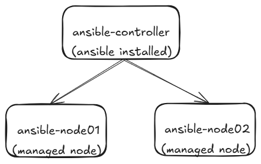

# Ansible Local Lab with Vagrant in No Time

> *“Today, we step into Act Two — where Vagrant doesn’t just spin up machines, but lays the foundation for something greater: Ansible.”*

In a world where infrastructure tools often compete with complexity, **Ansible** sets itself apart by keeping things refreshingly simple. It’s like that developer who shows up early, fixes half the issues before standup, and does it all with nothing more than YAML, SSH, and quiet confidence.

**Ansible** uses simple, human-readable scripts written in **YAML**, called *playbooks*, to automate tasks. You declare the desired state of a local or remote system, and Ansible ensures it stays that way. It’s agentless, relying on **SSH** for communication and **Python** on the target machines to execute tasks — no daemons, no fuss.


---

## Why Build a Local Lab?

Before you deploy Ansible in production or try to tame a horde of cloud VMs, you need a safe space to test, break, and experiment.

Enter **Vagrant**.

With it, we can spin up a lightweight lab on your laptop:  
- 1x Control Node (where Ansible is installed)
- 2x Managed Nodes (target servers for playbooks)




All of it on your machine. No cloud bills. No billing alarms.

## The `Vagrantfile`: Defining Our Lab

Here’s the entire `Vagrantfile` we’ll use to build the lab:

```ruby

# script to install and configure ansible on controller node
$ansibleSetup = <<-'SCRIPT'

sudo dnf install epel-release -y
sudo dnf install ansible -y

sudo tee -a /etc/ansible/ansible.cfg > /dev/null <<EOF

[defaults]
host_key_checking = False
EOF

SCRIPT


Vagrant.configure("2") do |config|

  # 'vagrant-hostmanager' plugin manages the '/etc/hosts' file on all the VMs, allowing them to resolve each other by hostname
  config.hostmanager.enabled = true
  config.hostmanager.manage_host = true

  ### Ansible Control Node ###
  config.vm.define "controller" do |controller|
      controller.vm.box = "geerlingguy/rockylinux8"
      controller.vm.hostname = "ansible-controller"
      controller.vm.network "private_network", ip: "192.168.56.10"

      controller.vm.provider "virtualbox" do |vb|
          vb.name = "ansible-controller"
          vb.memory = "1024"
          vb.cpus = "1"
      end

      # executing `ansibleSetup` on the controller node
      controller.vm.provision "shell", inline: $ansibleSetup

  end

  ### Ansible Node 01 ###
  config.vm.define "node01" do |node01|
      node01.vm.box = "geerlingguy/rockylinux8"
      node01.vm.hostname = "ansible-node01"
      node01.vm.network "private_network", ip: "192.168.56.11"

      node01.vm.provider "virtualbox" do |vb|
          vb.name = "ansible-node01"
          vb.memory = "512"
          vb.cpus = "1"
      end
  end

  ### Ansible Node 02 ###
  config.vm.define "node02" do |node02|
      node02.vm.box = "geerlingguy/rockylinux8"
      node02.vm.hostname = "ansible-node02"
      node02.vm.network "private_network", ip: "192.168.56.12"

      node02.vm.provider "virtualbox" do |vb|
          vb.name = "ansible-node02"
          vb.memory = "512"
          vb.cpus = "1"
      end      
  end

end
```


### Let’s Break It Down

#### `$ansibleSetup` Script

This block provisions the **controller node**:
- Installs **EPEL** and **Ansible**
- Adds a minimal `ansible.cfg` to **disable host key checking** (avoids SSH prompts)

#### `config.vm.define`
We create **three virtual machines**:
- **Controller**: 1 GB RAM, with Ansible installed
- **Node01** and **Node02**: 512 MB RAM each, act as Ansible targets

Each machine has a **private static IP** and uses the **`geerlingguy/rockylinux8`** Vagrant box — a community favorite for Ansible labs.

#### Host Management
`vagrant-hostmanager` plugin keeps `/etc/hosts` files in sync, so machines can refer to each other by hostname.

### Boot the Lab

Step 1: Install the Vagrant Hostmanager Plugin

Before running the Vagrantfile, you’ll need to install the `vagrant-hostmanager` plugin. This handy tool manages the `/etc/hosts` file on both your host machine and the VMs, allowing them to resolve each other by hostname (like `ansible-controller`, `ansible-node01`, etc.).

```bash
vagrant plugin install vagrant-hostmanager
```

> Note: You might need **admin/root privileges** depending on your system. On Linux/macOS, run with `sudo` if needed.

Once installed, the plugin will automatically update host entries during `vagrant up` and `vagrant halt`.


Step 2: Bring up the VMs
```bash
vagrant up
```


Step 3: Create Your Inventory

Once the machines are running, SSH into the controller and create an inventory file:

```bash
vagrant ssh controller
```

```ini
# /vagrant/inventory.ini

[all]
192.168.56.10
192.168.56.11
192.168.56.12

[controller]
192.168.56.10

[nodes]
192.168.56.11
192.168.56.12

[all:vars]
ansible_connection=ssh
ansible_user=vagrant
ansible_ssh_pass=vagrant
```

This is how Ansible knows where to connect, and who’s who in your infrastructure. The `vagrant` user with `vagrant` password is preconfigured on all Vagrant boxes — easy and perfect for learning.

### Test It!

From the controller node:

```bash
ansible -i /vagrant/inventory.ini all -m ping
```

If all goes well, you’ll get a “pong” from every host. Congratulations. You’ve built your first functioning **Ansible lab**.


---

## Final Thoughts

This lab is simple — but simplicity is underrated. Especially in automation.

In under 10 minutes, you’ve created a test environment that mirrors real-world infrastructure. You can now:
- Write and test **Ansible playbooks**
- Practice **role-based automation**
- Experiment fearlessly, with no risk to production

> So the next time you hear someone say “just SSH in and fix it,” politely smile, open your laptop, and say: “Or maybe I’ll write a playbook.”

Because automation isn’t just faster — it’s smarter.

---

```json
{
    "author"   :  "Kartik Dudeja",
    "email"    :  "kartikdudeja21@gmail.com",
    "linkedin" :  "https://linkedin.com/in/kartik-dudeja",
    "github"   :  "https://github.com/Kartikdudeja"
}
```
