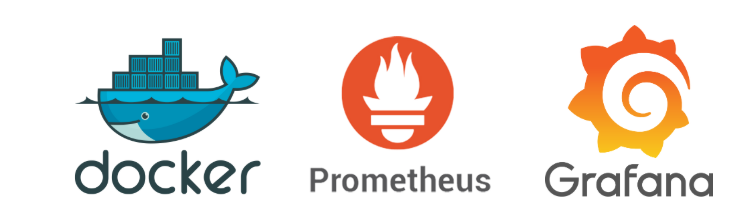

# 🔍 Observability in Minutes: A Docker Lab for Metrics & Alerts

> "You can’t manage what you don’t measure — observability is the first step to system improvement."

In today’s distributed and containerized world, observability has transitioned from a luxury to a necessity. Whether you’re a DevOps engineer, SRE, or curious developer trying to make sense of a flurry of metrics, setting up an observability lab is an excellent way to sharpen your tooling skills and build muscle memory around monitoring systems.

In this post, we’ll walk through how to create a fully functional **observability lab** using **Docker Compose**. It will include:

* **Prometheus** for time-series metric collection
* **Grafana** for visualizing those metrics
* **Node Exporter** instances to simulate multiple hosts
* **Alertmanager** for triggering alerts based on thresholds

Let’s get our hands dirty!




---

## 🧰 What You’ll Need

* Docker & Docker Compose installed
* A basic understanding of container networking
* Some curiosity and \~5 minutes of your time
      
## 🗂️ The Stack Overview

Here’s what our stack looks like:

| Component       | Purpose                                | Port   |
| --------------- | -------------------------------------- | ------ |
| Prometheus      | Scrapes and stores metrics             | `9090` |
| Grafana         | Dashboards & visualizations            | `3000` |
| Alertmanager    | Manages alerts generated by Prometheus | `9093` |
| Node Exporter 1 | Exposes host metrics (simulated node)  | `9101` |
| Node Exporter 2 | Another node for scale demonstration   | `9102` |

All components are networked together using Docker’s bridge network (`obs-lab`) and data is persisted via named volumes.

## 📦 The `docker-compose.yml`

Here's the full Docker Compose configuration we used for this lab:

```yaml
services:

  prometheus:
    container_name: prometheus
    hostname: prometheus
    image: prom/prometheus
    restart: always
    command:
      - --storage.tsdb.retention.time=7d
      - --config.file=/etc/prometheus/prometheus.yml
    volumes:
      - "./conf/prometheus/prometheus.yml:/etc/prometheus/prometheus.yml"
      - "./conf/prometheus/alerts.rules.yml:/etc/prometheus/rules.yml"
      - prometheusData:/prometheus
    networks:
      - obs-lab
    ports:
      - 9090:9090


  grafana:
    container_name: grafana
    hostname: grafana
    image: grafana/grafana
    restart: always
    depends_on:
      - prometheus
    volumes:
      - "./conf/grafana/datasources:/etc/grafana/provisioning/datasources"
      - "./conf/grafana/dashboards:/etc/grafana/provisioning/dashboards"
      - grafanaData:/var/lib/grafana
    networks:
      - obs-lab
    ports:
      - 3000:3000

  alertmanager:
    container_name: alertmanager
    hostname: alertmanager
    image: prom/alertmanager:v0.23.0
    command:
      - --config.file=/etc/alertmanager/alertmanager.yml
      - --log.level=debug
    restart: always
    depends_on:
      - prometheus
    volumes:
      - "./conf/prometheus/alertmanager.yml:/etc/alertmanager/alertmanager.yml"
      - alertmanagerData:/data
    networks:
      - obs-lab
    ports:
      - 9093:9093

  node-exporter-1:
    container_name: node-exporter-1
    hostname: node-exporter-1
    image: prom/node-exporter
    restart: always
    depends_on:
      - prometheus
    networks:
      - obs-lab
    ports:
      - 9101:9100

  node-exporter-2:
    container_name: node-exporter-2
    hostname: node-exporter-2
    image: prom/node-exporter
    restart: always
    depends_on:
      - prometheus
    networks:
      - obs-lab
    ports:
      - 9102:9100

networks:
    obs-lab:
      driver: bridge

volumes:
  grafanaData: {}
  prometheusData: {}
  alertmanagerData: {}

```

This setup launches:

* Prometheus with 7 days of retention and two alerting files mounted.
* Grafana with provisioned dashboards and data sources.
* Two Node Exporters to simulate monitoring multiple servers.
* Alertmanager configured to respond to alert rules defined in Prometheus.

> 💡 **Tip**: The `volumes` section ensures your data persists across container restarts.


## 📁 Folder Structure

To keep things clean, you might want to use the following directory structure:

```bash
observability-lab/
├── docker-compose.yml
└── conf/
    ├── grafana/
    │   ├── datasources/
    │   │   └── datasources.yaml 
    │   └── dashboards/
    │       ├── dashboards.yaml
    │       └── node_exporter_dashboard.json
    └── prometheus/
        ├── prometheus.yml
        ├── alerts.rules.yml
        └── alertmanager.yml
```


## 🔧 Configuration Essentials

### 1. **Prometheus Configuration (`prometheus.yml`)**

Make sure it includes your node exporters and Alertmanager:

```yaml
global:
  scrape_interval: 15s

scrape_configs:

  - job_name: prometheus
    static_configs:
    - targets:
      - prometheus:9090

  - job_name: node
    static_configs:
    - targets:
      - node-exporter-1:9100
      - node-exporter-2:9100

  - job_name: alertmanager
    static_configs:
    - targets:
      - alertmanager:9093

alerting:
  alertmanagers:
    - scheme: http
      static_configs:
        - targets: [ 'alertmanager:9093' ]

rule_files:
  - rules.yml
```

### 2. **Alert Rules (`alerts.rules.yml`)**

```yaml
groups:

- name: node_exporter_alerts

  rules:
  - alert: Node down
    expr: up{job="node"} == 0
    for: 2m
    labels:
      severity: warning
    annotations:
      title: Node {{ $labels.instance }} is down
      description: Failed to scrape {{ $labels.job }} on {{ $labels.instance }} for more than 2 minutes. Node seems down.
```

### 3. **Alertmanager Config (`alertmanager.yml`)**

```yaml
global:
  resolve_timeout: 1m

route:
  receiver: 'mail'
  repeat_interval: 1h
  group_by: [ alertname ]

receivers:
  - name: 'mail'
    email_configs:
      - smarthost: 'smtp.email.com:587'
        auth_username: 'alertmanager@email.com'
        auth_password: 'password'
        from: 'alertmanager@email.com'
        to: 'your@email.com'
```

> 🔐 Be sure to replace email configs with real credentials or use a webhook/slack integration.


## 🚀 Running the Lab

From the root of your project:

```bash
docker-compose up -d
```

Check the status:

```bash
docker-compose ps
```

You should see five running containers. Now visit:

* **Prometheus** → [http://localhost:9090](http://localhost:9090)
* **Grafana** → [http://localhost:3000](http://localhost:3000)
* **Alertmanager** → [http://localhost:9093](http://localhost:9093)

Default Grafana login:

* **User**: `admin`
* **Password**: `admin`


## 🔔 Triggering Alerts

Try stopping one of the Node Exporter containers:

```bash
docker-compose stop node-exporter-1
```

Within 30 seconds, Prometheus will trigger an alert that flows to Alertmanager.


## 🧹 Tearing It Down

Once done, you can remove the environment with:

```bash
docker-compose down -v
```

This will also delete volumes. Skip the `-v` flag if you want to preserve your data.

---

## 🧠 Final Thoughts

Setting up an observability lab like this is more than just an academic exercise. It’s the first step toward understanding how your systems behave in real time — and how you can make them better.

With this foundation, you can extend your lab to:

* Monitor Docker host metrics
* Add Blackbox Exporter or PushGateway
* Test auto-scaling and self-healing logic
* Visualize custom app metrics with client libraries

Stay observant, stay proactive.

---

```json
{
    "author"   :  "Kartik Dudeja",
    "email"    :  "kartikdudeja21@gmail.com",
    "linkedin" :  "https://linkedin.com/in/kartik-dudeja",
    "github"   :  "https://github.com/Kartikdudeja"
}
```
