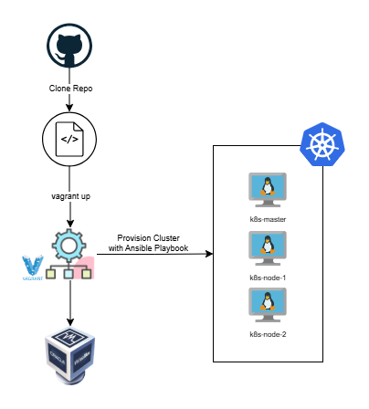

# 🧪DevOps Sandbox: Build Your Own Kubernetes Lab with Vagrant & Ansible

> 💡 *"The best lab is the one you can break and fix a hundred times without cost or consequence."*

If you’ve ever wanted to spin up a full-fledged Kubernetes cluster for learning, testing, or demonstrating tooling—without touching the cloud or provisioning anything beyond your laptop—this guide is for you.

We'll be using **Vagrant** to automate the provisioning of virtual machines and **Ansible** to configure them into a fully functioning Kubernetes cluster. This setup gives you a reproducible, portable lab that mirrors real-world infrastructure—perfect for experiments, CI, or training.

Let’s dive into the setup.




## 🛠️ Lab Architecture

We'll build a 3-node Kubernetes cluster:

* **1 master node** (`k8s-master`)
* **2 worker nodes** (`k8s-node-1`, `k8s-node-2`)

Each VM is built on Ubuntu 22.04, with VirtualBox as the hypervisor. The master runs with 2 CPUs and 2 GB of RAM, while workers get 1 CPU and 1 GB each.

Here’s the directory structure:

```
kubernetes-cluster/
├── Vagrantfile
├── config
|   └── containerd
|       └── config.toml
└── k8s-setup/
    ├── inventory.ini
    ├── k8s-prereq.yaml
    ├── k8s-master.yaml
    └── k8s-worker.yaml
```

## 🧳 Step 1: Vagrantfile – Define Your Lab

Here’s the core configuration that provisions all three VMs:

```ruby
# Vagrantfile for setting up the Kubernetes Lab

# base box image for VMs
IMAGE_NAME="bento/ubuntu-22.04"

# number of worker node in the k8s cluster
WORKER_NODES=2

# worker nodes resources
NODE_CPUS=1                                 # cpu core count assigned to VM
NODE_MEMORY=1024                            # memory (in GB)

# master node resources
MASTER_CPUS=2
MASTER_MEMORY=2048

Vagrant.configure("2") do |config|

    # manages the /etc/hosts file on guest machines in multi-machine environments
    config.hostmanager.enabled = true
    config.hostmanager.manage_host = true

    # common configuration for the hypervisor
    config.vm.provider "virtualbox" do |vb|
        # fix for slow network speed issue
        vb.customize ["modifyvm", :id, "--natdnshostresolver1", "on"]
        vb.customize ["modifyvm", :id, "--natdnsproxy1", "on"]
    end

    ### Worker Node Configuration ###
    (1..WORKER_NODES).each do |i|
        config.vm.define "k8s-node-#{i}" do |node|
    
            node.vm.box = IMAGE_NAME
            node.vm.network "private_network", ip: "10.10.10.#{i + 100}"
            node.vm.hostname = "k8s-node-#{i}"
            node.vm.provision "shell", inline: "sudo timedatectl set-timezone Asia/Kolkata"

            node.vm.provider "virtualbox" do |vb|
                vb.name = "k8s-node-#{i}"
                vb.memory = NODE_MEMORY
                vb.cpus = NODE_CPUS
            end
        end
    end

    ### Master Node Configuraton ###
    config.vm.define "k8s-master" do |master|
    
        master.vm.box = IMAGE_NAME
        master.vm.network "private_network", ip: "10.10.10.100"
        master.vm.hostname = "k8s-master"

        master.vm.provider "virtualbox" do |vb|
            vb.name = "k8s-master"
            vb.memory = MASTER_MEMORY
            vb.cpus = MASTER_CPUS
        end

        # Provisioning Kubernetes Cluster:
        master.vm.provision "shell", inline: <<-SHELL

            sudo timedatectl set-timezone Asia/Kolkata
            
            echo -e "$(date '+%F %T') INFO: Installing Ansible on master node"

            # install ansible
            echo | sudo apt-add-repository ppa:ansible/ansible
            sudo apt update
            sudo apt install ansible -y
            sleep 15

            echo -e "$(date '+%F %T') INFO: Running Ansible Playbook for setting up and configuring k8s pre-requisites"

            # configure master node in k8s cluster
            ansible-playbook -i /vagrant/k8s-setup/inventory.ini /vagrant/k8s-setup/k8s-prereq.yaml
            EXIT_CODE=$?
            
            if [ $EXIT_CODE -eq 0 ]
            then

                sleep 30

                echo -e "$(date '+%F %T') INFO: Running Ansible Playbook for setting up and configuring k8s master node"
                ansible-playbook -i /vagrant/k8s-setup/inventory.ini /vagrant/k8s-setup/k8s-master.yaml
                EXIT_CODE=$?

                if [ $EXIT_CODE -eq 0 ]
                then

                    sleep 30
                    echo -e "$(date '+%F %T') INFO: Running Ansible Playbook for setting up and configuring k8s worker node"
                    
                    # configure worker node in k8s cluster
                    ansible-playbook -i /vagrant/k8s-setup/inventory.ini /vagrant/k8s-setup/k8s-worker.yaml
                    EXIT_CODE=$?

                    if [ $EXIT_CODE -eq 0 ]
                    then

                        sleep 30
                        echo -e "$(date '+%F %T') INFO: Setting up labels on the k8s nodes"

                        # add lables to k8s nodes
                        kubectl --kubeconfig /home/vagrant/.kube/config label node k8s-master node-role.kubernetes.io/master=master
                        kubectl --kubeconfig /home/vagrant/.kube/config label node k8s-node-1 node-role.kubernetes.io/worker=worker
                        kubectl --kubeconfig /home/vagrant/.kube/config label node k8s-node-2 node-role.kubernetes.io/worker=worker

                    else
                        echo -e "$(date '+%F %T') ERROR: Error occured while executing k8s node ansible-playbook"
                    fi

                    echo -e "$(date '+%F %T') INFO: Installing helm on master node"

                    # Install helm
                    curl --silent https://baltocdn.com/helm/signing.asc | gpg --dearmor | sudo tee /usr/share/keyrings/helm.gpg > /dev/null
                    sudo apt-get install apt-transport-https --yes
                    echo "deb [arch=$(dpkg --print-architecture) signed-by=/usr/share/keyrings/helm.gpg] https://baltocdn.com/helm/stable/debian/ all main" | sudo tee /etc/apt/sources.list.d/helm-stable-debian.list
                    sudo apt-get update
                    sudo apt-get install helm

                else
                    echo -e "$(date '+%F %T') ERROR: Error occured while executing k8s master ansible-playbook"
                fi

            else
                echo -e "$(date '+%F %T') ERROR: Error occured while executing k8s setup ansible-playbook"
            fi

        SHELL
    end
end
```

Notable features:

* Assigns static private IPs (10.10.10.x range)
* Installs Ansible on the master node
* Calls Ansible playbooks for provisioning the full cluster stack
* Automatically applies node labels and installs Helm

## 📦 Step 2: Ansible Playbooks – Configure the Cluster

### 1. 🧱 `k8s-prereq.yaml`: Prepare All Nodes

This playbook prepares all nodes (master + workers) by:

* Enabling required kernel modules and sysctl configs
* Installing containerd and Docker dependencies
* Setting up the Kubernetes repo and installing kubelet/kubeadm/kubectl
* Configuring each node’s IP for kubelet
* Adding `vagrant` user to the `docker` group

```yaml

- name: "Setup pre-requisite for k8s cluster"

  hosts: cluster
  become: true
  become_method: sudo
  gather_facts: true

  vars:
    K8S_VERSION: "1.29"

  tasks:

  - name: "Setting up Configuration for IP Bridge"
    shell: |
      cat << EOF | sudo tee /etc/modules-load.d/k8s.conf
      overlay
      br_netfilter
      EOF
      
      sudo modprobe overlay
      sudo modprobe br_netfilter

      cat << EOF | sudo tee /etc/sysctl.d/k8s.conf
      net.bridge.bridge-nf-call-iptables  = 1
      net.bridge.bridge-nf-call-ip6tables = 1
      net.ipv4.ip_forward                 = 1
      EOF

      sudo sysctl --system

  - name: "Install pre-requisite packages"
    apt:
      name: "{{ PACKAGES }}"
      state: present
      update_cache: yes

    vars:
      PACKAGES:
        - apt-transport-https
        - ca-certificates
        - curl
        - gnupg-agent
        - software-properties-common

  - name: "Add an apt signing key for container package"
    apt_key:
      url: https://download.docker.com/linux/ubuntu/gpg
      state: present

  - name: "Add apt repository for stable version of container package"
    apt_repository:
      repo: deb [arch=amd64] https://download.docker.com/linux/ubuntu {{ ansible_lsb.codename }} stable
      state: present

  - name: "Install containerd service and dependencies"
    apt:
      name: "{{ PACKAGES }}"
      state: present
      update_cache: yes

    vars:
      PACKAGES:
        - docker-ce
        - docker-ce-cli
        - containerd.io

  - name: "containerd configuration setup"
    copy:
      src: "{{ item.src }}"
      dest: "{{ item.dest }}"
    with_items:
      - { src: /vagrant/config/containerd/config.toml, dest: /etc/containerd/config.toml }

  - name: "Reload systemd daemon"
    command: systemctl daemon-reload

  - name: "Enable and Start containerd service"
    service:
      name: containerd
      state: restarted
      enabled: yes

  - name: "Remove swapfile from '/etc/fstab'"
    mount:
      name: "{{ item }}"
      fstype: swap
      state: absent

    with_items:
      - swap
      - none

  - name: "Disable Swap"
    command: sudo swapoff -a
    when: ansible_swaptotal_mb > 0

  - name: "Ensure apt keyrings directory exists"
    file:
      path: /etc/apt/keyrings
      state: directory

  - name: "Delete kubernetes keyrings if exists"
    file:
      path: /etc/apt/keyrings/kubernetes-apt-keyring.gpg
      state: absent

  - name: "Add kubernetes apt repository key"
    shell: >
      curl -fsSL https://pkgs.k8s.io/core:/stable:/v{{ K8S_VERSION }}/deb/Release.key | sudo gpg --dearmor -o /etc/apt/keyrings/kubernetes-apt-keyring.gpg    

  - name: "Add kubernetes repository to sources list"
    apt_repository:
      repo: deb [signed-by=/etc/apt/keyrings/kubernetes-apt-keyring.gpg] https://pkgs.k8s.io/core:/stable:/v{{ K8S_VERSION }}/deb/ /
      state: present
      filename: kubernetes
      update_cache: yes

  - name: "Install kubernetes binaries"
    apt: 
      name:
        - kubelet={{ K8S_VERSION }}.*
        - kubeadm={{ K8S_VERSION }}.*
        - kubectl={{ K8S_VERSION }}.*
      state: present
      update_cache: yes

  - name: "Mark hold on k8s binaries"
    shell:
      cmd: sudo apt-mark hold kubelet kubeadm kubectl

  - name: "Configure Node IP"
    lineinfile:
      path: /etc/default/kubelet
      line: KUBELET_EXTRA_ARGS=--node-ip={{ ansible_eth1.ipv4.address }}
      create: yes

  - name: "Restart kubelet service"
    service:
      name: kubelet
      state: restarted
      daemon_reload: yes
      enabled: yes

  - name: "Add vagrant user to docker group"
    user:
      name: vagrant
      groups: docker
      append: yes

```

### 2. 🧠 `k8s-master.yaml`: Initialize the Master

This playbook:

* Runs `kubeadm init`
* Configures kubeconfig for the `vagrant` user
* Installs Calico CNI
* Removes the default taint from the control-plane
* Outputs a `kubeadm join` command to be used by the workers

```yaml
# k8s-master.yaml
- name: "Setup and Configure Kubernetes Master Node"

  hosts: master
  become: true
  become_method: sudo  
  gather_facts: true

  vars:
    POD_NETWORK_CIDR: "10.10.0.0/16"
    K8S_MASTER_NODE_NAME: "k8s-master"
    K8S_MASTER_NODE_IP: "10.10.10.100"

  tasks:

  - name: "Initialize kubernetes cluster using kubeadm"
    command: kubeadm init --cri-socket /var/run/containerd/containerd.sock --apiserver-advertise-address="{{ K8S_MASTER_NODE_IP }}" --apiserver-cert-extra-sans="{{ K8S_MASTER_NODE_IP }}"  --node-name {{ K8S_MASTER_NODE_NAME }} --pod-network-cidr={{ POD_NETWORK_CIDR }}

  - name: "Setup kubeconfig for 'vagrant' user"
    command: "{{ item }}"
    with_items:
      - mkdir -p /home/vagrant/.kube
      - cp -i /etc/kubernetes/admin.conf /home/vagrant/.kube/config
      - chown vagrant:vagrant /home/vagrant/.kube/config    

  # Setup the container networking provider and the network policy engine 
  - name: "Install calico pod network"
    become: false
    command: kubectl --kubeconfig /home/vagrant/.kube/config apply -f https://docs.projectcalico.org/manifests/calico.yaml

  - name: "Remove Taint from Master Node"
    become: false
    shell:
      cmd: kubectl --kubeconfig /home/vagrant/.kube/config taint nodes {{ K8S_MASTER_NODE_NAME }} node-role.kubernetes.io/control-plane:NoSchedule-

  - name: "Generate join command for nodes to join the k8s cluster"
    command: kubeadm token create --print-join-command
    register: join_command

  - name: "copy join command to local file"
    local_action: copy content="{{ join_command.stdout_lines[0] }}" dest="./join-command"
```

⚠️ The generated join command is written to a file locally. This is later copied to the worker nodes.

### 3. 🧑‍🏭 `k8s-worker.yaml`: Join Worker Nodes

This playbook:

* Copies the join command to each worker
* Appends the containerd socket to the join command
* Joins the node to the cluster using `kubeadm`
* Restarts the kubelet service after joining

```yaml
# k8s-worker.yaml
- name: "Setup and Configure Kubernetes Worker Node"

  hosts: worker
  become: true
  become_method: sudo
  gather_facts: true

  tasks:

  - name: "Copy the join command to server location"
    copy:
      src: join-command
      dest: /tmp/k8s-cluster-join-command.sh
      mode: 0755

  - name: "Add cri-socket arg to kubeadm join command"
    command: sed -i 's|$| --cri-socket /var/run/containerd/containerd.sock|' /tmp/k8s-cluster-join-command.sh

  - name: "Join the Node to the k8s cluster"
    command: sh /tmp/k8s-cluster-join-command.sh

    notify:
      - Restart kubelet service

  handlers:
    - name: "Restart kubelet service"
      service:
        name: kubelet
        state: restarted
```

## 📋 Inventory File

Your `inventory.ini` should categorize the nodes like so:

```ini
[all]
k8s-master ansible_ssh_host=10.10.10.100
k8s-node-1 ansible_ssh_host=10.10.10.101
k8s-node-2 ansible_ssh_host=10.10.10.102

[master]
k8s-master ansible_ssh_host=10.10.10.100

[worker]
k8s-node-1 ansible_ssh_host=10.10.10.101
k8s-node-2 ansible_ssh_host=10.10.10.102

[cluster]
k8s-master ansible_ssh_host=10.10.10.100
k8s-node-1 ansible_ssh_host=10.10.10.101
k8s-node-2 ansible_ssh_host=10.10.10.102

[all:vars]
ansible_ssh_user=vagrant
ansible_ssh_pass=vagrant
ansible_host_key_checking=false
ansible_python_interpreter=/usr/bin/python3
ansible_ssh_common_args='-o StrictHostKeyChecking=no'
```

## 🚀 Bootstrapping the Lab

Once everything is in place:

1. Clone your repo or setup directory.
2. Run:
    ```bash
    vagrant up
    ```
3. Sit back and let Vagrant and Ansible do their magic. It’ll take a few minutes.

You’ll end up with a fully initialized Kubernetes cluster on your local machine. To access it:

```bash
vagrant ssh k8s-master
kubectl get nodes
```

## 🎁 Bonus: Helm Installed by Default

The setup script also installs Helm on the master node, making it easy to test out Helm charts and manage add-ons right away.

## 🧹 Tear Down When Done

To clean up your lab environment:

```bash
vagrant destroy -f
```

---

## 📘 Final Thoughts

> "If you have a reasonably powerful laptop and prefer not to burn a hole in your wallet with cloud bills, this local Kubernetes lab setup is your perfect playground to learn, experiment, and break things safely."

This lab is ideal for:

* Practicing Kubernetes operations
* Developing Helm charts
* Running quick PoCs without needing cloud infra

It’s modular, portable, and fast to spin up—just like your favorite dev tools should be.

---

```json
{
    "author"   :  "Kartik Dudeja",
    "email"    :  "kartikdudeja21@gmail.com",
    "linkedin" :  "https://linkedin.com/in/kartik-dudeja",
    "github"   :  "https://github.com/Kartikdudeja"
}
```
