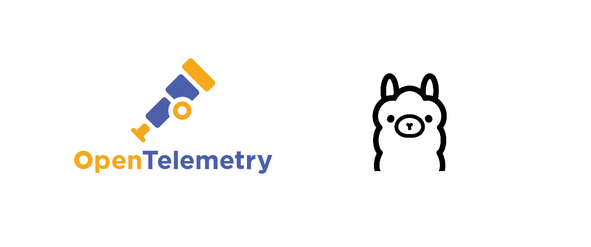

# LLM Observability with OpenTelemetry: A Practical Guide

Large Language Models (LLMs) have quickly become the backbone of many modern applications—from chatbots to Retrieval-Augmented Generation (RAG) systems. But here’s the challenge: these models often behave like **black boxes**.

Without observability, we’re left guessing:

* Why did the model respond that way?
* Which prompt caused this hallucination?
* How much are we spending on tokens?
* What’s the latency impact of retrieval vs. generation?

This is where **OpenTelemetry (OTel)** steps in. By instrumenting our LLM applications, we can capture **traces, metrics, and logs**—turning the black box into a glass box.



---

## Core Observability Signals for LLMs

When instrumenting an LLM app, we focus on:

1. **Request Traces**
   * Span for **retrieval** (with metadata: source, number of documents, latency).
   * Span for **LLM inference** (with metadata: model name, temperature, prompt, response length).

2. **Metrics**
   * **Request Volume**: Counter of incoming user queries.
   * **Request Duration**: Histogram for latency distribution.
   * **Token Counters**: Number of tokens generated/consumed.
   * **Cost**: Gauge or counter for estimated token cost.

3. **Logs**
   * Structured logs that capture **prompts, responses, and errors**.
   * Correlated with traces via trace IDs.

### Tech Stack

* **LLM runtime**: [Ollama](https://ollama.ai) (local inference of Mistral)
* **Framework**: [LangChain](https://www.langchain.com/)
* **Vector DB**: Chroma
* **Observability**: OpenTelemetry Python SDK
* **Backends**: Jaeger (traces), Prometheus (metrics), Loki (logs)

---

## Instrumenting a RAG Application

Let’s consider a simple **RAG pipeline**:

* Use a retriever to fetch relevant documents.
* Build a prompt.
* Send it to the LLM (e.g., via [Ollama](https://ollama.ai/)).
* Return the answer.

With OpenTelemetry, we wrap each stage in **spans**, collect **metrics**, and emit **logs**.

### Prerequisites: Building a RAG Application

Before we dive into instrumentation, you’ll need a working **RAG (Retrieval-Augmented Generation) application**.

If you don’t have one yet, follow this step-by-step tutorial first:

**[Building a Simple RAG Application with Ollama and LangChain](https://www.youtube.com/watch?v=E4l91XKQSgw)**
*(this guide walks through setting up embeddings, a vector store, and a basic question-answering loop)*

Once you have your RAG pipeline up and running, come back here—we’ll add **observability** so you can monitor and debug it like a pro.

---

## Observability in Action

Let’s break down how Traces, Metrics, and Logs bring observability to an LLM-powered RAG application.

### Traces: Following the Flow

**Why Traces Matter**
Traces help you follow a user query as it flows through your RAG pipeline—retrieval, prompt building, LLM generation. They provide visibility into **where time is spent** and **what inputs/outputs influenced the result**.

#### Instrumentation Code for Traces

We’ll wire up OpenTelemetry to:

* Export traces to Jaeger (via OTLP).
* Create spans for:
  * The **user question** loop.
  * The **retriever call**.
  * The **LLM call**.
* Add **semantic attributes** about:
  * App metadata (`app.name`, `app.version`, etc).
  * SDK details (`telemetry.sdk.language`, `telemetry.sdk.name`).
  * Query text, model name, retriever results count, etc.

```python
import time
import json

# --- OpenTelemetry Tracing ---
from opentelemetry import trace, metrics
from opentelemetry.sdk.trace import TracerProvider
from opentelemetry.sdk.resources import Resource
from opentelemetry.sdk.trace.export import BatchSpanProcessor
from opentelemetry.exporter.otlp.proto.grpc.trace_exporter import OTLPSpanExporter

# Define resource attributes (metadata about the service)
resource = Resource.create({
    "service.name": "faq-rag",
    "service.version": "1.0.0",
    "app.environment": "dev",
    "app.owner": "observability-team",
    "telemetry.sdk.language": "python",
    "telemetry.sdk.name": "opentelemetry"
})

# --- Configure Tracing ---
trace.set_tracer_provider(TracerProvider(resource=resource))
tracer = trace.get_tracer(__name__)

# Configure OTLP exporter (sending traces to Jaeger/Collector)
otlp_trace_exporter = OTLPSpanExporter(endpoint="http://127.0.0.1:4317", insecure=True)
span_processor = BatchSpanProcessor(otlp_trace_exporter)
trace.get_tracer_provider().add_span_processor(span_processor)

# --- LangChain + Ollama ---
from langchain_ollama.llms import OllamaLLM
from langchain_core.prompts import ChatPromptTemplate
from vector import retriever

# Initialize the Ollama model
model = OllamaLLM(
    model="mistral",
    temperature=0.7,
    top_p=0.9
)

# Define the prompt template
template = """
You are an expert in answering questions about a pizza restaurant.

Here are some relevant reviews: {reviews}

Here is the question to answer: {question}
"""

prompt = ChatPromptTemplate.from_template(template)

# Build pipeline
chain = prompt | model

# --- Interactive Loop ---
while True:
    question = input("Ask your question (q to quit): ")

    if question.lower() == "q":
        break

    start_request = time.time()
    with tracer.start_as_current_span("rag-request") as span:
        span.set_attribute("rag.query", question)

        # --- Retrieval step ---
        with tracer.start_as_current_span("vector-retrieval") as retrieval_span:
            start_retrieval = time.time()
            reviews = retriever.invoke(question)
            retrieval_time = time.time() - start_retrieval

            retrieval_span.set_attribute("retriever.engine", "chroma")
            retrieval_span.set_attribute("retriever.search.k", 5)
            retrieval_span.set_attribute("retriever.latency.ms", retrieval_time * 1000)
            retrieval_span.set_attribute("retriever.documents.count", len(reviews))

            doc_previews = [
                (doc.page_content[:80] + "...") if len(doc.page_content) > 80 else doc.page_content
                for doc in reviews
            ]
            
            retrieval_span.set_attribute("retriever.documents.preview", json.dumps(doc_previews))

        # --- LLM Call ---
        formatted_prompt = prompt.format_prompt(
            reviews=reviews,
            question=question
        ).to_string()

        # --- LLM step ---
        with tracer.start_as_current_span("llm-call") as llm_span:

            llm_span.set_attribute("llm.provider", "ollama")
            llm_span.set_attribute("llm.model.name", "mistral")
            llm_span.set_attribute("llm.request.temperature", getattr(model, "temperature", None))
            llm_span.set_attribute("llm.request.top_p", getattr(model, "top_p", None))
            llm_span.set_attribute("llm.prompt.details", formatted_prompt)

            start_llm = time.time()
            result = chain.invoke({
                "reviews": reviews,
                "question": question
            })
            llm_latency = time.time() - start_llm

            tokens_in = len(formatted_prompt.split())
            tokens_out = len(str(result).split())
            cost_estimate = (tokens_in + tokens_out) * 0.000001  # fake cost

            # Response metadata
            llm_span.set_attribute("llm.response.details", str(result))
            llm_span.set_attribute("llm.response.tokens.input", tokens_in)
            llm_span.set_attribute("llm.response.tokens.output", tokens_out)
            llm_span.set_attribute("llm.response.tokens.total", tokens_in + tokens_out)
            llm_span.set_attribute("llm.response.cost.usd_estimate", cost_estimate)
            llm_span.set_attribute("llm.latency.ms", llm_latency * 1000)
        span.set_attribute("rag.answer.preview", str(result)[:120])

    print(f"\n{result}")
    print(80 * "-")
```

---

### Logs: Capturing the Details

**Why Logs Matter**
Logs give you the **raw evidence** of what happened inside your LLM pipeline — including prompts, responses, and errors. Unlike traces (timing) and metrics (aggregates), logs capture **content and context**.

#### JSON Logging for Better ETL

Instead of plain text logs, it’s best to use **structured JSON logs**:

* Easy to parse with tools like **Loki**, **Elasticsearch**, or any ETL pipeline.
* Enables filtering and aggregation on fields (`trace_id`, `span_id`, `user_id`, etc.).
* Standardized format across services.

With JSON, your observability backend can:

* Extract fields for **ETL pipelines** (e.g., export tokens + cost for billing).
* Enable **structured search** (e.g., “find all requests with doc\_count < 2”).
* Power **dashboards** that combine logs + metrics.

#### Correlating Logs and Traces

To connect logs with traces:

* Include **trace\_id** and **span\_id** in every log line.
* Use the **current span context** from OpenTelemetry.

**Code (Python with OTel)**
``` python
import time
import json

# --- OpenTelemetry Tracing ---
from opentelemetry import trace, metrics
from opentelemetry.sdk.trace import TracerProvider
from opentelemetry.sdk.resources import Resource
from opentelemetry.sdk.trace.export import BatchSpanProcessor
from opentelemetry.exporter.otlp.proto.grpc.trace_exporter import OTLPSpanExporter

# --- OpenTelemetry Logging ---
import logging
from opentelemetry.sdk._logs import LoggerProvider, LoggingHandler
from opentelemetry.sdk._logs.export import BatchLogRecordProcessor
from opentelemetry.exporter.otlp.proto.grpc._log_exporter import OTLPLogExporter

# Define resource attributes (metadata about the service)
resource = Resource.create({
    "service.name": "faq-rag",
    "service.version": "1.0.0",
    "app.environment": "dev",
    "app.owner": "observability-team",
    "telemetry.sdk.language": "python",
    "telemetry.sdk.name": "opentelemetry"
})

# --- Configure Tracing ---
trace.set_tracer_provider(TracerProvider(resource=resource))
tracer = trace.get_tracer(__name__)

# Configure OTLP exporter (sending traces to Jaeger/Collector)
otlp_trace_exporter = OTLPSpanExporter(endpoint="http://127.0.0.1:4317", insecure=True)
span_processor = BatchSpanProcessor(otlp_trace_exporter)
trace.get_tracer_provider().add_span_processor(span_processor)

# Setup logger provider
logger_provider = LoggerProvider(resource=resource)
log_exporter = OTLPLogExporter(endpoint="http://127.0.0.1:4317", insecure=True)
logger_provider.add_log_record_processor(BatchLogRecordProcessor(log_exporter))

# Custom JSON Formatter
class JSONFormatter(logging.Formatter):
    def format(self, record):

        span = trace.get_current_span()
        span_context = span.get_span_context()

        log_record = {
            "timestamp": self.formatTime(record, self.datefmt),
            "severity": record.levelname,
            "logger": record.name,
            "message": record.getMessage(),
            "trace_id": span_context.trace_id if span_context.is_valid else None,
            "span_id": span_context.span_id if span_context.is_valid else None            
        }
        # Add extra attributes if available
        if hasattr(record, "args") and isinstance(record.args, dict):
            log_record.update(record.args)
        if hasattr(record, "extra") and isinstance(record.extra, dict):
            log_record.update(record.extra)

        return json.dumps(log_record)

# Attach JSON formatter to OTel handler
otel_handler = LoggingHandler(level=logging.INFO, logger_provider=logger_provider)
otel_handler.setFormatter(JSONFormatter())

logging.basicConfig(level=logging.INFO, handlers=[otel_handler])
logger = logging.getLogger("faq-rag")

# --- LangChain + Ollama ---
from langchain_ollama.llms import OllamaLLM
from langchain_core.prompts import ChatPromptTemplate
from vector import retriever

# Initialize the Ollama model
model = OllamaLLM(
    model="mistral",
    temperature=0.7,
    top_p=0.9
)

# Define the prompt template
template = """
You are an expert in answering questions about a pizza restaurant.

Here are some relevant reviews: {reviews}

Here is the question to answer: {question}
"""

prompt = ChatPromptTemplate.from_template(template)

# Build pipeline
chain = prompt | model

# --- Interactive Loop ---
while True:
    question = input("Ask your question (q to quit): ")

    if question.lower() == "q":
        break

    logger.info("Received user query", extra={"query": question})

    start_request = time.time()
    with tracer.start_as_current_span("rag-request") as span:
        span.set_attribute("rag.query", question)

        # --- Retrieval step ---
        with tracer.start_as_current_span("vector-retrieval") as retrieval_span:
            start_retrieval = time.time()
            reviews = retriever.invoke(question)
            retrieval_time = time.time() - start_retrieval

            logger.info("Retrieved documents", extra={
                "query": question,
                "retriever.latency_ms": retrieval_time * 1000,
                "retriever.documents.count": len(reviews),
            })

            retrieval_span.set_attribute("retriever.engine", "chroma")
            retrieval_span.set_attribute("retriever.search.k", 5)
            retrieval_span.set_attribute("retriever.latency.ms", retrieval_time * 1000)
            retrieval_span.set_attribute("retriever.documents.count", len(reviews))

            doc_previews = [
                (doc.page_content[:80] + "...") if len(doc.page_content) > 80 else doc.page_content
                for doc in reviews
            ]
            
            retrieval_span.set_attribute("retriever.documents.preview", json.dumps(doc_previews))

        # --- LLM Call ---
        formatted_prompt = prompt.format_prompt(
            reviews=reviews,
            question=question
        ).to_string()

        # --- LLM step ---
        with tracer.start_as_current_span("llm-call") as llm_span:

            llm_span.set_attribute("llm.provider", "ollama")
            llm_span.set_attribute("llm.model.name", "mistral")
            llm_span.set_attribute("llm.request.temperature", getattr(model, "temperature", None))
            llm_span.set_attribute("llm.request.top_p", getattr(model, "top_p", None))
            llm_span.set_attribute("llm.prompt.details", formatted_prompt)

            logger.info("Invoking LLM", extra={
                "model": "mistral",
                "temperature": getattr(model, "temperature", None),
                "top_p": getattr(model, "top_p", None),
                "prompt_preview": formatted_prompt[:120],
            })

            start_llm = time.time()
            result = chain.invoke({
                "reviews": reviews,
                "question": question
            })
            llm_latency = time.time() - start_llm

            tokens_in = len(formatted_prompt.split())
            tokens_out = len(str(result).split())
            cost_estimate = (tokens_in + tokens_out) * 0.000001  # fake cost

            logger.info("LLM response generated", extra={
                "latency_ms": llm_latency * 1000,
                "tokens_in": tokens_in,
                "tokens_out": tokens_out,
                "cost_estimate": cost_estimate,
                "answer_preview": str(result)[:120]
            })

            # Response metadata
            llm_span.set_attribute("llm.response.details", str(result))
            llm_span.set_attribute("llm.response.tokens.input", tokens_in)
            llm_span.set_attribute("llm.response.tokens.output", tokens_out)
            llm_span.set_attribute("llm.response.tokens.total", tokens_in + tokens_out)
            llm_span.set_attribute("llm.response.cost.usd_estimate", cost_estimate)
            llm_span.set_attribute("llm.latency.ms", llm_latency * 1000)

        span.set_attribute("rag.answer.preview", str(result)[:120])

    print(f"\n{result}")
    print(80 * "-")

```

**How correlation helps**

* From a **trace in Jaeger**, you can jump to the corresponding **logs in Loki** by filtering on `trace_id`.
* From a **log line**, you can pivot back to the full **trace** to see the request lifecycle.
* This bridges **high-cardinality events** (logs) with **low-cardinality context** (traces).

---

### Metrics: Measuring What Matters

**Why Metrics Matter**
Metrics provide **aggregated, time-series insights** into your system. While traces help debug individual requests and logs capture raw details, metrics allow you to **monitor trends** (e.g., request rates, latency, cost over time).

For an LLM RAG pipeline, the key metrics are:

#### What Metrics to Collect

1. **Request Volume**
   * Counts how many requests hit the RAG pipeline.
   * Helps detect traffic spikes, drops, or usage trends.

2. **Request Duration**
   * Measures latency of end-to-end RAG queries.
   * Useful for SLO/SLI dashboards and user experience monitoring.

3. **Token Usage**
   * Tracks `prompt_tokens` and `completion_tokens`.
   * Shows efficiency of prompts and cost correlation.

4. **Cost Estimation**
   * Approximates \$\$ cost based on tokens and model pricing.
   * Useful for **FinOps** and controlling LLM usage bills.

#### OTel Metrics Instrumentation

```python
import time
import json

# --- OpenTelemetry Tracing ---
from opentelemetry import trace, metrics
from opentelemetry.sdk.trace import TracerProvider
from opentelemetry.sdk.resources import Resource
from opentelemetry.sdk.trace.export import BatchSpanProcessor
from opentelemetry.exporter.otlp.proto.grpc.trace_exporter import OTLPSpanExporter

# --- OpenTelemetry Metrics ---
from opentelemetry.sdk.metrics import MeterProvider
from opentelemetry.exporter.otlp.proto.grpc.metric_exporter import OTLPMetricExporter
from opentelemetry.sdk.metrics.export import PeriodicExportingMetricReader

# --- OpenTelemetry Logging ---
import logging
from opentelemetry.sdk._logs import LoggerProvider, LoggingHandler
from opentelemetry.sdk._logs.export import BatchLogRecordProcessor
from opentelemetry.exporter.otlp.proto.grpc._log_exporter import OTLPLogExporter

# Define resource attributes (metadata about the service)
resource = Resource.create({
    "service.name": "faq-rag",
    "service.version": "1.0.0",
    "app.environment": "dev",
    "app.owner": "observability-team",
    "telemetry.sdk.language": "python",
    "telemetry.sdk.name": "opentelemetry"
})

# --- Configure Tracing ---
trace.set_tracer_provider(TracerProvider(resource=resource))
tracer = trace.get_tracer(__name__)

# Configure OTLP exporter (sending traces to Jaeger/Collector)
otlp_trace_exporter = OTLPSpanExporter(endpoint="http://127.0.0.1:4317", insecure=True)
span_processor = BatchSpanProcessor(otlp_trace_exporter)
trace.get_tracer_provider().add_span_processor(span_processor)

# --- Configure Metrics ---
metric_exporter = OTLPMetricExporter(endpoint="http://127.0.0.1:4317", insecure=True)
reader = PeriodicExportingMetricReader(metric_exporter, export_interval_millis=5000)

provider = MeterProvider(resource=resource, metric_readers=[reader])
metrics.set_meter_provider(provider)
meter = metrics.get_meter(__name__)

# Define custom metrics
request_counter = meter.create_counter(
    "rag_requests_total",
    unit="1",
    description="Total number of RAG requests"
)

request_duration_hist = meter.create_histogram(
    "rag_request_duration_ms",
    unit="ms",
    description="Duration of RAG requests in milliseconds"
)

token_input_counter = meter.create_counter(
    "rag_tokens_input_total",
    unit="tokens",
    description="Total input tokens sent to LLM"
)

token_output_counter = meter.create_counter(
    "rag_tokens_output_total",
    unit="tokens",
    description="Total output tokens generated by LLM"
)

token_total_counter = meter.create_counter(
    "rag_tokens_total",
    unit="tokens",
    description="Total tokens (input + output)"
)

cost_counter = meter.create_counter(
    "rag_cost_usd_total",
    unit="usd",
    description="Estimated total cost of LLM requests"
)

# Setup logger provider
logger_provider = LoggerProvider(resource=resource)
log_exporter = OTLPLogExporter(endpoint="http://127.0.0.1:4317", insecure=True)
logger_provider.add_log_record_processor(BatchLogRecordProcessor(log_exporter))

# Custom JSON Formatter
class JSONFormatter(logging.Formatter):
    def format(self, record):

        span = trace.get_current_span()
        span_context = span.get_span_context()

        log_record = {
            "timestamp": self.formatTime(record, self.datefmt),
            "severity": record.levelname,
            "logger": record.name,
            "message": record.getMessage(),
            "trace_id": span_context.trace_id if span_context.is_valid else None,
            "span_id": span_context.span_id if span_context.is_valid else None            
        }
        # Add extra attributes if available
        if hasattr(record, "args") and isinstance(record.args, dict):
            log_record.update(record.args)
        if hasattr(record, "extra") and isinstance(record.extra, dict):
            log_record.update(record.extra)

        return json.dumps(log_record)

# Attach JSON formatter to OTel handler
otel_handler = LoggingHandler(level=logging.INFO, logger_provider=logger_provider)
otel_handler.setFormatter(JSONFormatter())

logging.basicConfig(level=logging.INFO, handlers=[otel_handler])
logger = logging.getLogger("faq-rag")

# --- LangChain + Ollama ---
from langchain_ollama.llms import OllamaLLM
from langchain_core.prompts import ChatPromptTemplate
from vector import retriever

# Initialize the Ollama model
model = OllamaLLM(
    model="mistral",
    temperature=0.7,
    top_p=0.9
)

# Define the prompt template
template = """
You are an expert in answering questions about a pizza restaurant.

Here are some relevant reviews: {reviews}

Here is the question to answer: {question}
"""

prompt = ChatPromptTemplate.from_template(template)

# Build pipeline
chain = prompt | model

# --- Interactive Loop ---
while True:
    question = input("Ask your question (q to quit): ")

    if question.lower() == "q":
        break

    logger.info("Received user query", extra={"query": question})

    start_request = time.time()
    with tracer.start_as_current_span("rag-request") as span:
        span.set_attribute("rag.query", question)

        # --- Retrieval step ---
        with tracer.start_as_current_span("vector-retrieval") as retrieval_span:
            start_retrieval = time.time()
            reviews = retriever.invoke(question)
            retrieval_time = time.time() - start_retrieval

            logger.info("Retrieved documents", extra={
                "query": question,
                "retriever.latency_ms": retrieval_time * 1000,
                "retriever.documents.count": len(reviews),
            })

            retrieval_span.set_attribute("retriever.engine", "chroma")
            retrieval_span.set_attribute("retriever.search.k", 5)
            retrieval_span.set_attribute("retriever.latency.ms", retrieval_time * 1000)
            retrieval_span.set_attribute("retriever.documents.count", len(reviews))

            doc_previews = [
                (doc.page_content[:80] + "...") if len(doc.page_content) > 80 else doc.page_content
                for doc in reviews
            ]
            
            retrieval_span.set_attribute("retriever.documents.preview", json.dumps(doc_previews))

        # --- LLM Call ---
        formatted_prompt = prompt.format_prompt(
            reviews=reviews,
            question=question
        ).to_string()

        # --- LLM step ---
        with tracer.start_as_current_span("llm-call") as llm_span:

            llm_span.set_attribute("llm.provider", "ollama")
            llm_span.set_attribute("llm.model.name", "mistral")
            llm_span.set_attribute("llm.request.temperature", getattr(model, "temperature", None))
            llm_span.set_attribute("llm.request.top_p", getattr(model, "top_p", None))
            llm_span.set_attribute("llm.prompt.details", formatted_prompt)

            logger.info("Invoking LLM", extra={
                "model": "mistral",
                "temperature": getattr(model, "temperature", None),
                "top_p": getattr(model, "top_p", None),
                "prompt_preview": formatted_prompt[:120],
            })

            start_llm = time.time()
            result = chain.invoke({
                "reviews": reviews,
                "question": question
            })
            llm_latency = time.time() - start_llm

            tokens_in = len(formatted_prompt.split())
            tokens_out = len(str(result).split())
            cost_estimate = (tokens_in + tokens_out) * 0.000001  # fake cost

            logger.info("LLM response generated", extra={
                "latency_ms": llm_latency * 1000,
                "tokens_in": tokens_in,
                "tokens_out": tokens_out,
                "cost_estimate": cost_estimate,
                "answer_preview": str(result)[:120]
            })

            # Response metadata
            llm_span.set_attribute("llm.response.details", str(result))
            llm_span.set_attribute("llm.response.tokens.input", tokens_in)
            llm_span.set_attribute("llm.response.tokens.output", tokens_out)
            llm_span.set_attribute("llm.response.tokens.total", tokens_in + tokens_out)
            llm_span.set_attribute("llm.response.cost.usd_estimate", cost_estimate)
            llm_span.set_attribute("llm.latency.ms", llm_latency * 1000)

            # --- Emit Metrics ---
            request_counter.add(1, {"rag.model": "mistral"})
            request_duration_hist.record((time.time() - start_request) * 1000, {"rag.model": "mistral"})
            token_input_counter.add(tokens_in, {"rag.model": "mistral"})
            token_output_counter.add(tokens_out, {"rag.model": "mistral"})
            token_total_counter.add(tokens_in + tokens_out, {"rag.model": "mistral"})
            cost_counter.add(cost_estimate, {"rag.model": "mistral"})

        span.set_attribute("rag.answer.preview", str(result)[:120])

    print(f"\n{result}")
    print(80 * "-")
```

---

## Setting up the Observability Stack with Docker Compose

All telemetry (traces, metrics, logs) from your RAG app will flow into the **OpenTelemetry Collector** first, then get routed to the right backend:

* **Traces → Jaeger**
* **Metrics → Prometheus**
* **Logs → Loki**
* **Visualization → Grafana**

### `docker-compose.yml`

``` yaml
services:
  otel-collector:
    container_name: otel-collector
    hostname: otel-collector
    image: otel/opentelemetry-collector-contrib:latest
    restart: always
    command: ["--config=/etc/otel-collector-config.yaml"]
    volumes:
      - ./config/otel-collector/otel-collector-config.yaml:/etc/otel-collector-config.yaml
    networks:
      - llm-obs-lab
    ports:
      - "4317:4317" # OTLP gRPC receiver
      - "4318:4318"
  jaeger:
    container_name: jaeger
    hostname: jaeger
    image: jaegertracing/all-in-one:latest
    restart: always
    volumes:
      - jaegar_data:/var/lib/jaeger
    networks:
      - llm-obs-lab
    ports:
      - "6831:6831/udp" # UDP port for Jaeger agent
      - "16686:16686" # Web UI
      - "14268:14268" # HTTP port for spans
  prometheus:
    container_name: prometheus
    hostname: prometheus
    image: prom/prometheus:latest
    restart: always
    command:
      - --storage.tsdb.retention.time=1d
      - --config.file=/etc/prometheus/prometheus.yml
    volumes:
      - prometheus_data:/prometheus
      - ./config/prometheus/prometheus.yml:/etc/prometheus/prometheus.yml
    networks:
      - llm-obs-lab
    ports:
      - "9090:9090"

  grafana:
    container_name: grafana
    hostname: grafana
    image: grafana/grafana
    restart: always
    volumes:
      - grafana_data:/var/lib/grafana
      - "./config/grafana/datasources:/etc/grafana/provisioning/datasources"    
    networks:
      - llm-obs-lab
    ports:
      - "3000:3000"

  loki:
    container_name: loki
    hostname: loki
    image: grafana/loki:latest
    restart: always
    command:
      - -config.file=/etc/loki/local-config.yaml
    volumes:
      - loki_data:/loki
      - "./config/loki/loki-config.yaml:/etc/loki/local-config.yaml"
    networks:
      - llm-obs-lab
    ports:
      - "3100:3100"  

networks:
  llm-obs-lab:
    driver: bridge

volumes:
  loki_data: {}
  jaegar_data: {}
  grafana_data: {}  
  prometheus_data: {}

```

### `otel-collector-config.yaml`

``` yaml
receivers:
  otlp:
    protocols:
      grpc:
        endpoint: 0.0.0.0:4317
      http:
        endpoint: 0.0.0.0:4318

processors:
  batch: {}

extensions:
  health_check: {}

exporters:
  otlp/jaeger:
    endpoint: jaeger:4317
    tls:
      insecure: true

  prometheus:
    endpoint: "0.0.0.0:9090"

  otlphttp:
    endpoint: http://loki:3100/otlp

service:

  pipelines:

    traces:
      receivers: [otlp]
      processors: [batch]      
      exporters: [otlp/jaeger]

    logs:
      receivers: [otlp]
      processors: [batch]
      exporters: [otlphttp]

    metrics:
      receivers: [otlp]
      processors: [batch]
      exporters: [prometheus]

```

### `prometheus.yml`
``` yaml
global:
  scrape_interval: 5s

scrape_configs:
  - job_name: 'otel-collector'
    static_configs:
      - targets: ['otel-collector:9090']
```

### `loki-config.yaml`
``` yaml
auth_enabled: false

server:
  http_listen_port: 3100
  grpc_listen_port: 9096

common:
  instance_addr: 127.0.0.1
  path_prefix: /tmp/loki
  storage:
    filesystem:
      chunks_directory: /tmp/loki/chunks
      rules_directory: /tmp/loki/rules
  replication_factor: 1
  ring:
    kvstore:
      store: inmemory

frontend:
  max_outstanding_per_tenant: 2048

pattern_ingester:
  enabled: true

limits_config:
  max_global_streams_per_user: 0
  ingestion_rate_mb: 50000
  ingestion_burst_size_mb: 50000
  volume_enabled: true

query_range:
  results_cache:
    cache:
      embedded_cache:
        enabled: true
        max_size_mb: 100

schema_config:
  configs:
    - from: 2020-10-24
      store: tsdb
      object_store: filesystem
      schema: v13
      index:
        prefix: index_
        period: 24h

analytics:
  reporting_enabled: false

```

### Grafana `datasources.yaml`
``` yaml
apiVersion: 1

datasources:
  - name: Prometheus
    type: prometheus
    url: http://prometheus:9090
    access: proxy
    basicAuth: false
    isDefault: true
    jsonData:
      tlsSkipVerify: true
    editable: false

  - name: Loki
    type: loki
    access: proxy
    url: http://loki:3100
    isDefault: false
    version: 1
    editable: false

  - name: Jaeger
    type: jaeger
    access: proxy
    url: http://jaeger:16686
    version: 1
    editable: false
```

## Bring Up the Stack

```bash
docker-compose up -d
```

* **Jaeger UI** → [http://localhost:16686](http://localhost:16686)
* **Prometheus UI** → [http://localhost:9090](http://localhost:9090)
* **Grafana UI** → [http://localhost:3000](http://localhost:3000) (user: `admin`, pass: `admin`)

## How Data Flows

* Your **RAG app** exports telemetry via OTLP (`4317` gRPC, `4318` HTTP).
* **OTel Collector** ingests all telemetry, applies batching, and routes it:

  * **Traces → Jaeger**
  * **Metrics → Prometheus (scraped at `/metrics`)**
  * **Logs → Loki**
* **Grafana** connects to all three for a unified view.

---

With this setup, you now have **end-to-end observability for your RAG application**:

* Debug request flow in **Jaeger**
* Track system health with **Prometheus**
* Investigate application logs in **Loki**
* Combine all of the above in **Grafana dashboards**

---

## How This Improves Observability

* **Latency analysis**: Traces show whether slow responses are due to retrieval or LLM generation.
* **Cost tracking**: Token counts let you estimate \$ spend directly from traces.
* **Debugging hallucinations**: Seeing prompts + responses helps you identify if poor answers came from bad retrieval or bad generation.
* **Model governance**: Attributes like `model`, `temperature`, `top_p` let you correlate behavior with configuration.

---

```json
{
    "author"   :  "Kartik Dudeja",
    "email"    :  "kartikdudeja21@gmail.com",
    "linkedin" :  "https://linkedin.com/in/kartik-dudeja",
    "github"   :  "https://github.com/Kartikdudeja"
}
```
