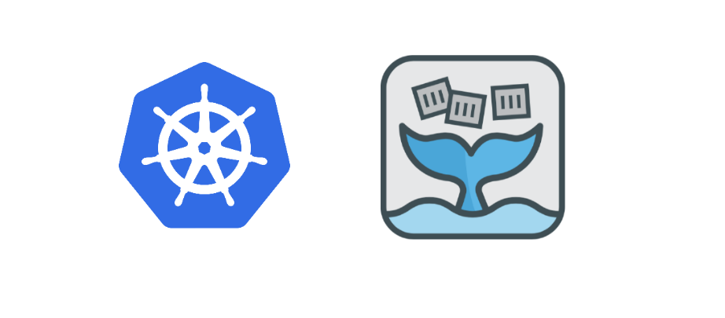
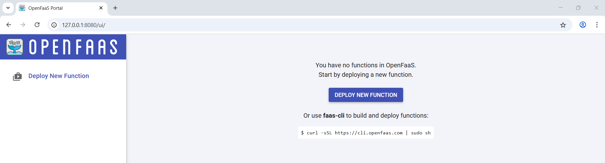
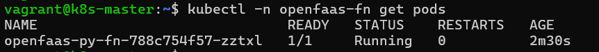
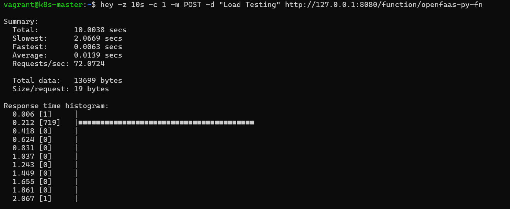

# ⚡ Going Serverless on Kubernetes with OpenFaaS

> **Build, ship, and scale functions — on your own Kubernetes cluster.**



## 1. What is Serverless?

**Serverless** allows developers to write and deploy code without worrying about the underlying infrastructure. The server still exists — you just don’t manage it.

Instead of provisioning and scaling servers, you:

* Write a function
* Deploy it
* Let the platform handle the rest (scaling, routing, etc.)

> Serverless is about **developer experience**, **efficiency**, and **auto-scaling** — perfect for microservices, APIs, and background tasks.

## 2. What is OpenFaaS?

**OpenFaaS** (Functions-as-a-Service) is an open-source serverless framework built for Kubernetes and Docker.

### 🔑 Key Features:

* Deploy serverless functions in containers
* CLI, UI, and REST API support
* Built-in Prometheus metrics
* Auto-scaling via function invocation count
* Supports multiple runtimes (Python, Node.js, Go, Bash, etc.)

### 📦 Serverless on Kubernetes with OpenFaaS:

OpenFaaS runs as a set of Kubernetes components:

* **Gateway**: Exposes functions over HTTP
* **Function Pods**: Each function is a container
* **Prometheus**: Scrapes function invocation metrics
* **Autoscaler**: Adds/removes replicas based on load

## 3. Installing OpenFaaS on Kubernetes with Arkade

[Arkade](https://github.com/alexellis/arkade) is a simple Kubernetes marketplace for installing apps.

### ✅ Prerequisites

* Kubernetes cluster (e.g., `minikube`, `kind`, `k3s`)
* `kubectl` installed
* `arkade` installed:

```bash
curl -sLS https://get.arkade.dev | sudo sh
```

### 🛠️ Install OpenFaaS:

```bash
arkade install openfaas
```

It will:

* Create `openfaas` and `openfaas-fn` namespaces
* Deploy the gateway, faas-netes, UI, and Prometheus

## 4. Accessing the OpenFaaS UI

### 🔑 Get admin password:

```bash
PASSWORD=$(kubectl get secret -n openfaas basic-auth \
-o jsonpath="{.data.basic-auth}" | base64 --decode)
echo $PASSWORD
```

### 🌐 Port-forward the gateway:

```bash
kubectl port-forward -n openfaas svc/gateway 8080:8080
```

Visit: [http://localhost:8080](http://localhost:8080)

Login with:

* **Username**: `admin`
* **Password**: from the command above



## 5. Creating a Sample Python Function (`python3-http`)

We’ll use the `python3-http` template which supports GET/POST with JSON or plain text input.

### 🔧 Step 1: Install the OpenFaaS CLI

```bash
curl -sSL https://cli.openfaas.com | sudo sh
```

Login via CLI:

```bash
faas-cli login --username admin --password $PASSWORD
```

#### Pull templates from store supported by openfaas
```bash
faas-cli template store pull python3-http
```

### 📁 Step 2: Create the function

```bash
faas-cli new openfaas-py-fn --lang python3-http
```

Edit `openfaas-py-fn/handler.py`:

```python
def handle(event, context):
    name = event.body.decode('utf-8') or "World"
    return {
        "statusCode": 200,
        "body": f"Hello, {name}",
        "headers": {
            "Content-Type": "text/plain"
        }
    }
```

### 📄 Step 3: Update `stack.yaml` file
```yaml
version: 1.0
provider:
  name: openfaas
  gateway: http://127.0.0.1:8080
functions:
  openfaas-py-fn:
    lang: python3-http
    handler: ./openfaas-py-fn
    image: <DOCKERHUB_USERNAME>/openfaas-py-fn:1.1
```

### 📦 Step 4: Build and Deploy
```bash
faas-cli build -f stack.yaml
faas-cli push -f stack.yaml
faas-cli deploy -f stack.yaml
```



## 6. Accessing the Function via cURL

```bash
curl -X POST http://localhost:8080/function/openfaas-py-fn -d "Testing"
```

Or through the **UI** → Click "Invoke" beside the function.

## 7. Configuring Auto-Scaling

OpenFaaS autoscaler monitors Prometheus metrics and scales functions automatically.

To customize:

Add this to `stack.yaml`:

```yaml
annotations:
  com.openfaas.scale.min: "1"
  com.openfaas.scale.max: "5"
```

Redeploy:

```bash
faas-cli deploy -f stack.yaml
```

Now, your function can scale up to 5 replicas during high load.

## 8. Prometheus Metrics and Grafana Dashboard

OpenFaaS installs **Prometheus** by default.

### 📊 Access Prometheus:

```bash
kubectl port-forward -n openfaas svc/prometheus 9090:9090
```

Visit [http://localhost:9090](http://localhost:9090)

Sample queries:

* `gateway_function_invocation_total`
* `gateway_function_invocation_duration_seconds`

### 📈 Grafana for Function Monitoring

You can install Grafana via Arkade:

```bash
arkade install grafana
```

Then port-forward it:

```bash
kubectl port-forward -n default svc/grafana 3000:3000
```

Login (default: `admin/admin`) and add Prometheus as a data source to create dashboards for OpenFaaS function metrics.

## 9. Load Testing with `hey` and Testing Auto-Scaling

[`hey`](https://github.com/rakyll/hey) is a lightweight load-testing tool.

### 🧪 Install hey:

```bash
go install github.com/rakyll/hey@latest
```

### 📌 Test Load:

```bash
hey -z 10s -c 1 -m POST -d "Load Testing" http://127.0.0.1:8080/function/openfaas-py-fn
```

Flags:

* `-z 10s`: Run for 10 seconds
* `-c 1`: 1 concurrent users



### 📈 Observe Auto-Scaling

Check current function replicas:

```bash
kubectl get deploy -n openfaas-fn openfaas-py-fn
```

It should scale up under heavy load.

You can also monitor this behavior live via the **OpenFaaS UI** or **Prometheus**.

---

## 🚀 Final Thoughts

**OpenFaaS + Kubernetes** brings the best of both worlds:

* The flexibility and portability of containers
* The simplicity and scalability of serverless

With a single CLI and a UI, OpenFaaS makes it fun to deploy and manage functions — without giving up observability, control, or performance.

---

```json
{
    "author"   :  "Kartik Dudeja",
    "email"    :  "kartikdudeja21@gmail.com",
    "linkedin" :  "https://linkedin.com/in/kartik-dudeja",
    "github"   :  "https://github.com/Kartikdudeja"
}
```
